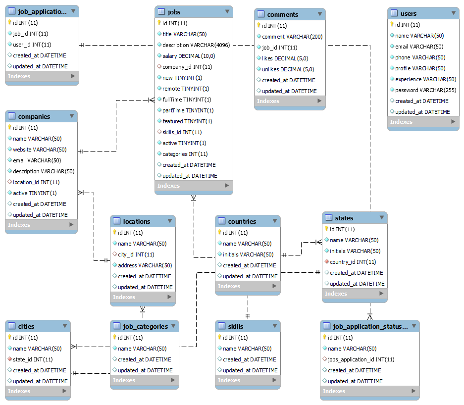

# Linder

Projeto de programação para dispositivos móveis - IFSP 2024. Tema: Rede social profissional, utilizados por profissionais e empressas

## Descrição

Backend do projeto. Criado em Python utilizando FastAPI. Banco de dados utilizando SQLAlchemy.

## Como usar com Docker (Recomendado)

### Dependencies

* Requer [Docker](https://www.docker.com/).

### Instalação

* Para compilar. Em "_./_" Execute o seguinte comando:
```
docker compose up --build
```
* Para parar a execução:
```
docker compose down
```
* Para executar novamente:
```
docker compose up
```

## Diagrama EER

